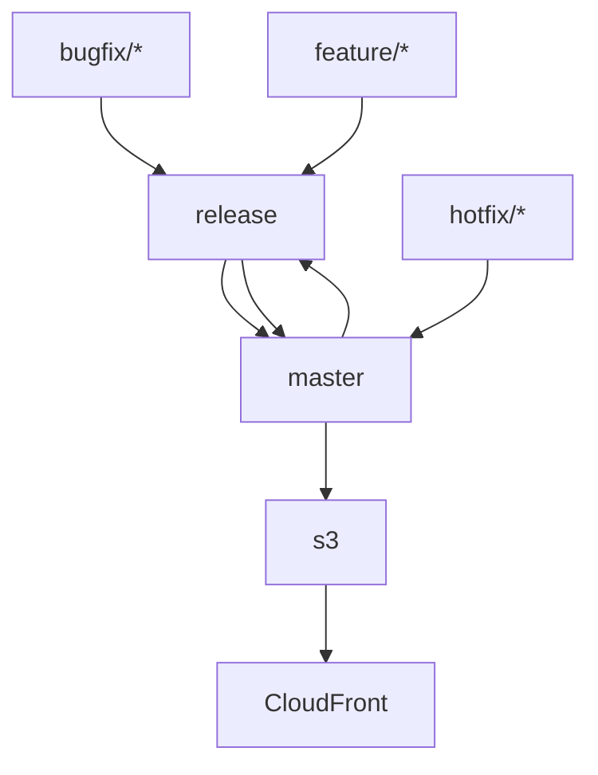

### Deploy Next.js to S3 CloudFront
In this example, Nest.js application is deployed as static resource to S3 and cloudfront using GithubActions. 
 
## Github Action Tagging and Branch release 
- Github action will create tags based oon incoming branches feature/*, bugfix/* or hotfix/* branch is merged into master 
- When hotfix/* is merged it will increment version in package.json and create github tag
- When feature/*, bugfix/ or hotfix/*  will be merged into master, it will rebase the the release branch on master
- When feature/*, release/* or bugfix/* will be merged into master it will increment branch version like 1.0.2 to 2.0.0. 
- Finally, Github action will deploy build to S3 and Cloudfront

## Git Workflow Diagram


# Github Secrets
Please add following secrets to run github actions:

Go to repository -> Settings -> Secrets and Variables -> Actions -> New repository secret

GH_PAT:<access_token>  
AWS_REGION: 
AWS_ACCESS_KEY_ID:
AWS_SECRET_ACCESS_KEY: 
CLOUDFRONT_DISTRIBUTION_ID:

# To add secrets to your GitHub repository:
- Go to your repository on GitHub.
- Click on Settings.
- In the Security section of the sidebar, click Secrets and variables.
- Click Actions.
- Click New repository secret.
- Add each secret with its corresponding value.

# Customizing the Workflow
* Branches: Adjust the branches in the push trigger to match your deployment strategy.
* Node Version: Adjust the Node.js version in the setup-node step if needed.
* Build Commands: Modify the build and export commands if your project uses different scripts or tools.
* This reusable GitHub Action workflow will streamline the process of deploying your Next.js application to S3 and invalidating the CloudFront cache automatically.


## Create Github Secrets

## Workflow permissions 
Settings -> Actions -> General -> Workflow permissions
You need to turn on Read and write permissions to push tags to github repository

## Next.js Local development

First, run the development server:

```bash
npm run dev
# or
yarn dev
# or
pnpm dev
# or
bun dev
```

Open [http://localhost:3000](http://localhost:3000) with your browser to see the result.

You can start editing the page by modifying `app/page.tsx`. The page auto-updates as you edit the file.

This project uses [`next/font`](https://nextjs.org/docs/basic-features/font-optimization) to automatically optimize and load Inter, a custom Google Font.

## Learn More

To learn more about Next.js, take a look at the following resources:

- [Next.js Documentation](https://nextjs.org/docs) - learn about Next.js features and API.
- [Learn Next.js](https://nextjs.org/learn) - an interactive Next.js tutorial.

You can check out [the Next.js GitHub repository](https://github.com/vercel/next.js/) - your feedback and contributions are welcome!

## Deploy on Vercel

The easiest way to deploy your Next.js app is to use the [Vercel Platform](https://vercel.com/new?utm_medium=default-template&filter=next.js&utm_source=create-next-app&utm_campaign=create-next-app-readme) from the creators of Next.js.

Check out our [Next.js deployment documentation](https://nextjs.org/docs/deployment) for more details.